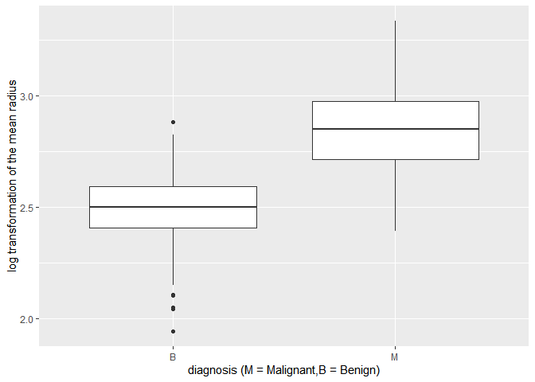
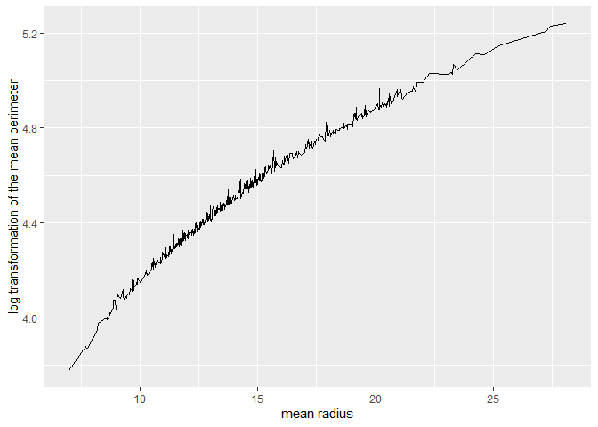

*To complete this milestone, you can either edit [this `.rmd`
file](https://raw.githubusercontent.com/UBC-STAT/stat545.stat.ubc.ca/master/content/mini-project/mini-project-2.Rmd)
directly. Fill in the sections that are commented out with
`<!--- start your work here--->`. When you are done, make sure to knit
to an `.md` file by changing the output in the YAML header to
`github_document`, before submitting a tagged release on canvas.*

# Welcome to the rest of your mini data analysis project!

In Milestone 1, you explored your data. and came up with research
questions. This time, we will finish up our mini data analysis and
obtain results for your data by:

-   Making summary tables and graphs
-   Manipulating special data types in R: factors and/or dates and
    times.
-   Fitting a model object to your data, and extract a result.
-   Reading and writing data as separate files.

We will also explore more in depth the concept of *tidy data.*

**NOTE**: The main purpose of the mini data analysis is to integrate
what you learn in class in an analysis. Although each milestone provides
a framework for you to conduct your analysis, it’s possible that you
might find the instructions too rigid for your data set. If this is the
case, you may deviate from the instructions – just make sure you’re
demonstrating a wide range of tools and techniques taught in this class.

# Instructions

**To complete this milestone**, edit [this very `.Rmd`
file](https://raw.githubusercontent.com/UBC-STAT/stat545.stat.ubc.ca/master/content/mini-project/mini-project-2.Rmd)
directly. Fill in the sections that are tagged with
`<!--- start your work here--->`.

**To submit this milestone**, make sure to knit this `.Rmd` file to an
`.md` file by changing the YAML output settings from
`output: html_document` to `output: github_document`. Commit and push
all of your work to your mini-analysis GitHub repository, and tag a
release on GitHub. Then, submit a link to your tagged release on canvas.

**Points**: This milestone is worth 50 points: 45 for your analysis, and
5 for overall reproducibility, cleanliness, and coherence of the Github
submission.

**Research Questions**: In Milestone 1, you chose two research questions
to focus on. Wherever realistic, your work in this milestone should
relate to these research questions whenever we ask for justification
behind your work. In the case that some tasks in this milestone don’t
align well with one of your research questions, feel free to discuss
your results in the context of a different research question.

# Learning Objectives

By the end of this milestone, you should:

-   Understand what *tidy* data is, and how to create it using `tidyr`.
-   Generate a reproducible and clear report using R Markdown.
-   Manipulating special data types in R: factors and/or dates and
    times.
-   Fitting a model object to your data, and extract a result.
-   Reading and writing data as separate files.

# Setup

Begin by loading your data and the tidyverse package below:

    library(datateachr) # <- might contain the data you picked!
    library(tidyverse)
    library(broom)

# Task 1: Process and summarize your data

From milestone 1, you should have an idea of the basic structure of your
dataset (e.g. number of rows and columns, class types, etc.). Here, we
will start investigating your data more in-depth using various data
manipulation functions.

### 1.1 (1 point)

First, write out the 4 research questions you defined in milestone 1
were. This will guide your work through milestone 2:

<!-------------------------- Start your work below ---------------------------->

1.  *Does radius\_mean and area\_mean influence the diagnosis result?*
2.  *Is there interaction between radius\_mean and perimeter\_mean?*
3.  *Which explanatory variable(every variables beside diagnosis) is the
    most statistical significance?*
4.  *Is there a positive or negative correlation between diagnosis and
    radius\_mean?*
    <!----------------------------------------------------------------------------->

Here, we will investigate your data using various data manipulation and
graphing functions.

### 1.2 (8 points)

Now, for each of your four research questions, choose one task from
options 1-4 (summarizing), and one other task from 4-8 (graphing). You
should have 2 tasks done for each research question (8 total). Make sure
it makes sense to do them! (e.g. don’t use a numerical variables for a
task that needs a categorical variable.). Comment on why each task helps
(or doesn’t!) answer the corresponding research question.

Ensure that the output of each operation is printed!

Also make sure that you’re using dplyr and ggplot2 rather than base R.
Outside of this project, you may find that you prefer using base R
functions for certain tasks, and that’s just fine! But part of this
project is for you to practice the tools we learned in class, which is
dplyr and ggplot2.

**Summarizing:**

1.  Compute the *range*, *mean*, and *two other summary statistics* of
    **one numerical variable** across the groups of **one categorical
    variable** from your data.
2.  Compute the number of observations for at least one of your
    categorical variables. Do not use the function `table()`!
3.  Create a categorical variable with 3 or more groups from an existing
    numerical variable. You can use this new variable in the other
    tasks! *An example: age in years into “child, teen, adult, senior”.*
4.  Compute the proportion and counts in each category of one
    categorical variable across the groups of another categorical
    variable from your data. Do not use the function `table()`!

**Graphing:**

1.  Create a graph of your choosing, make one of the axes logarithmic,
    and format the axes labels so that they are “pretty” or easier to
    read.
2.  Make a graph where it makes sense to customize the alpha
    transparency.

Using variables and/or tables you made in one of the “Summarizing”
tasks:

1.  Create a graph that has at least two geom layers.
2.  Create 3 histograms, with each histogram having different sized
    bins. Pick the “best” one and explain why it is the best.

Make sure it’s clear what research question you are doing each operation
for!

<!------------------------- Start your work below ----------------------------->

    # research question 1 
    # task 2: It's helpful because it gives us a better visualization of the number of patients with malignant and benign cancer, which is our response variable. 
    cancer_sample %>% 
      count(diagnosis)

    ## # A tibble: 2 × 2
    ##   diagnosis     n
    ##   <chr>     <int>
    ## 1 B           357
    ## 2 M           212

    # task 6: It's not particularly useful because we don't know if we need to do a log transformation on radius_mean. 
    ggplot(data=cancer_sample, aes(x=diagnosis, y=log(radius_mean)))+geom_boxplot()+labs(x="diagnosis (M = Malignant,B = Benign)", y="log transformation of the mean radius")

    # research question 2 
    # task 3:
    cancer_sample %>%
      select(diagnosis,radius_mean) %>%
      mutate(size = case_when(radius_mean < 10 ~ "small",
                              radius_mean < 20 ~ "medium",
                                     TRUE ~ "large"))

    ## # A tibble: 569 × 3
    ##    diagnosis radius_mean size  
    ##    <chr>           <dbl> <chr> 
    ##  1 M                18.0 medium
    ##  2 M                20.6 large 
    ##  3 M                19.7 medium
    ##  4 M                11.4 medium
    ##  5 M                20.3 large 
    ##  6 M                12.4 medium
    ##  7 M                18.2 medium
    ##  8 M                13.7 medium
    ##  9 M                13   medium
    ## 10 M                12.5 medium
    ## # ℹ 559 more rows

    # task 6: It's not particularly useful because we don't know if we need to do a log transformation on either radius_mean or perimeter mean. 
    ggplot(data=cancer_sample, aes(x=radius_mean, y=log(perimeter_mean)))+geom_line()+labs(x="mean radius", y="log transformation of the mean perimeter")

    # research question 3 
    # task 2: It's helpful because it gives us a better visualization of the number of patients with malignant and benign cancer, which is our response variable. 
    cancer_sample %>% 
      count(diagnosis)

    ## # A tibble: 2 × 2
    ##   diagnosis     n
    ##   <chr>     <int>
    ## 1 B           357
    ## 2 M           212

    # task 6: It's not particularly useful because we don't know if we need to do a log transformation on area_mean, but boxplots are useful to identify statistical significance. 
    ggplot(data=cancer_sample, aes(x=diagnosis, y=log(area_mean)))+geom_boxplot()+labs(x="diagnosis (M = Malignant,B = Benign)", y="log transformation of the mean area")

    # research question 4 
    # task 2: It's helpful because it gives us a better visualization of the number of patients with malignant and benign cancer, which is our response variable.   
    summary_table <- cancer_sample %>% 
      count(diagnosis)
    summary_table

    ## # A tibble: 2 × 2
    ##   diagnosis     n
    ##   <chr>     <int>
    ## 1 B           357
    ## 2 M           212

    # task 6: It's not particularly useful because we don't know if we need to do a log transformation on radius_mean. 
    ggplot(data=cancer_sample, aes(x=diagnosis, y=log(radius_mean)))+geom_boxplot()+labs(x="diagnosis (M = Malignant,B = Benign)", y="log transformation of the mean radius")

<!----------------------------------------------------------------------------->

### 1.3 (2 points)

Based on the operations that you’ve completed, how much closer are you
to answering your research questions? Think about what aspects of your
research questions remain unclear. Can your research questions be
refined, now that you’ve investigated your data a bit more? Which
research questions are yielding interesting results?

<!------------------------- Write your answer here ---------------------------->

For research question 1 and 3 we are a bit closer to have answers. We
just need to repeat a similar process for other explanatory variables.
Question 2 and 3 still remains unclear because we didn’t plot
interaction and correlation. The research questions can definitely be
refined and trimmed down to be more precise and simple. None so far are
yielding interesting results.

<!----------------------------------------------------------------------------->

# Task 2: Tidy your data

In this task, we will do several exercises to reshape our data. The goal
here is to understand how to do this reshaping with the `tidyr` package.

A reminder of the definition of *tidy* data:

-   Each row is an **observation**
-   Each column is a **variable**
-   Each cell is a **value**

### 2.1 (2 points)

Based on the definition above, can you identify if your data is tidy or
untidy? Go through all your columns, or if you have &gt;8 variables,
just pick 8, and explain whether the data is untidy or tidy.

<!--------------------------- Start your work below --------------------------->

    data <- cancer_sample %>%
      select(c(ID,diagnosis,radius_mean,texture_mean,perimeter_mean,area_mean,smoothness_mean,compactness_mean))
    glimpse(data)

    ## Rows: 569
    ## Columns: 8
    ## $ ID               <dbl> 842302, 842517, 84300903, 84348301, 84358402, 843786,…
    ## $ diagnosis        <chr> "M", "M", "M", "M", "M", "M", "M", "M", "M", "M", "M"…
    ## $ radius_mean      <dbl> 17.990, 20.570, 19.690, 11.420, 20.290, 12.450, 18.25…
    ## $ texture_mean     <dbl> 10.38, 17.77, 21.25, 20.38, 14.34, 15.70, 19.98, 20.8…
    ## $ perimeter_mean   <dbl> 122.80, 132.90, 130.00, 77.58, 135.10, 82.57, 119.60,…
    ## $ area_mean        <dbl> 1001.0, 1326.0, 1203.0, 386.1, 1297.0, 477.1, 1040.0,…
    ## $ smoothness_mean  <dbl> 0.11840, 0.08474, 0.10960, 0.14250, 0.10030, 0.12780,…
    ## $ compactness_mean <dbl> 0.27760, 0.07864, 0.15990, 0.28390, 0.13280, 0.17000,…

    sum(is.na(cancer_sample))

    ## [1] 0

The data looks clean and we don’t have any missing values. Overall the
data looks tidy.
<!----------------------------------------------------------------------------->

### 2.2 (4 points)

Now, if your data is tidy, untidy it! Then, tidy it back to it’s
original state.

If your data is untidy, then tidy it! Then, untidy it back to it’s
original state.

Be sure to explain your reasoning for this task. Show us the “before”
and “after”.

<!--------------------------- Start your work below --------------------------->

    untidydata <- cancer_sample %>%
      mutate(diagnosis = case_when(diagnosis == 'B' ~ 'B',
                               TRUE ~ NA))
    head(untidydata)

    ## # A tibble: 6 × 32
    ##         ID diagnosis radius_mean texture_mean perimeter_mean area_mean
    ##      <dbl> <chr>           <dbl>        <dbl>          <dbl>     <dbl>
    ## 1   842302 <NA>             18.0         10.4          123.      1001 
    ## 2   842517 <NA>             20.6         17.8          133.      1326 
    ## 3 84300903 <NA>             19.7         21.2          130       1203 
    ## 4 84348301 <NA>             11.4         20.4           77.6      386.
    ## 5 84358402 <NA>             20.3         14.3          135.      1297 
    ## 6   843786 <NA>             12.4         15.7           82.6      477.
    ## # ℹ 26 more variables: smoothness_mean <dbl>, compactness_mean <dbl>,
    ## #   concavity_mean <dbl>, concave_points_mean <dbl>, symmetry_mean <dbl>,
    ## #   fractal_dimension_mean <dbl>, radius_se <dbl>, texture_se <dbl>,
    ## #   perimeter_se <dbl>, area_se <dbl>, smoothness_se <dbl>,
    ## #   compactness_se <dbl>, concavity_se <dbl>, concave_points_se <dbl>,
    ## #   symmetry_se <dbl>, fractal_dimension_se <dbl>, radius_worst <dbl>,
    ## #   texture_worst <dbl>, perimeter_worst <dbl>, area_worst <dbl>, …

    tidydata <- cancer_sample %>%
      mutate(diagnosis = case_when(diagnosis == 'B' ~ 'B',
                               TRUE ~ 'M'))
    head(tidydata)

    ## # A tibble: 6 × 32
    ##         ID diagnosis radius_mean texture_mean perimeter_mean area_mean
    ##      <dbl> <chr>           <dbl>        <dbl>          <dbl>     <dbl>
    ## 1   842302 M                18.0         10.4          123.      1001 
    ## 2   842517 M                20.6         17.8          133.      1326 
    ## 3 84300903 M                19.7         21.2          130       1203 
    ## 4 84348301 M                11.4         20.4           77.6      386.
    ## 5 84358402 M                20.3         14.3          135.      1297 
    ## 6   843786 M                12.4         15.7           82.6      477.
    ## # ℹ 26 more variables: smoothness_mean <dbl>, compactness_mean <dbl>,
    ## #   concavity_mean <dbl>, concave_points_mean <dbl>, symmetry_mean <dbl>,
    ## #   fractal_dimension_mean <dbl>, radius_se <dbl>, texture_se <dbl>,
    ## #   perimeter_se <dbl>, area_se <dbl>, smoothness_se <dbl>,
    ## #   compactness_se <dbl>, concavity_se <dbl>, concave_points_se <dbl>,
    ## #   symmetry_se <dbl>, fractal_dimension_se <dbl>, radius_worst <dbl>,
    ## #   texture_worst <dbl>, perimeter_worst <dbl>, area_worst <dbl>, …

In order to untidy it I change all the M diagnosis into NA/missing
values. Then to tidy it I change it back to M.
<!----------------------------------------------------------------------------->

### 2.3 (4 points)

Now, you should be more familiar with your data, and also have made
progress in answering your research questions. Based on your interest,
and your analyses, pick 2 of the 4 research questions to continue your
analysis in the remaining tasks:

<!-------------------------- Start your work below ---------------------------->

1.  *Does radius\_mean and area\_mean influence the diagnosis result?*
2.  *Which explanatory variable(every variables beside diagnosis) is the
    most statistical significance?*

<!----------------------------------------------------------------------------->

Explain your decision for choosing the above two research questions.

<!--------------------------- Start your work below --------------------------->

These two questions are more relevant to what we are doing in this
course.
<!----------------------------------------------------------------------------->

Now, try to choose a version of your data that you think will be
appropriate to answer these 2 questions. Use between 4 and 8 functions
that we’ve covered so far (i.e. by filtering, cleaning, tidy’ing,
dropping irrelevant columns, etc.).

(If it makes more sense, then you can make/pick two versions of your
data, one for each research question.)

<!--------------------------- Start your work below --------------------------->

    rdata <- cancer_sample %>%
      select(diagnosis:fractal_dimension_worst) %>%
      drop_na() %>%
      group_by(diagnosis) %>%
      mutate(diagnosis = case_when(diagnosis == 'B' ~ 0,
                               diagnosis == 'M' ~ 1))
    rdata

    ## # A tibble: 569 × 31
    ## # Groups:   diagnosis [2]
    ##    diagnosis radius_mean texture_mean perimeter_mean area_mean smoothness_mean
    ##        <dbl>       <dbl>        <dbl>          <dbl>     <dbl>           <dbl>
    ##  1         1        18.0         10.4          123.      1001           0.118 
    ##  2         1        20.6         17.8          133.      1326           0.0847
    ##  3         1        19.7         21.2          130       1203           0.110 
    ##  4         1        11.4         20.4           77.6      386.          0.142 
    ##  5         1        20.3         14.3          135.      1297           0.100 
    ##  6         1        12.4         15.7           82.6      477.          0.128 
    ##  7         1        18.2         20.0          120.      1040           0.0946
    ##  8         1        13.7         20.8           90.2      578.          0.119 
    ##  9         1        13           21.8           87.5      520.          0.127 
    ## 10         1        12.5         24.0           84.0      476.          0.119 
    ## # ℹ 559 more rows
    ## # ℹ 25 more variables: compactness_mean <dbl>, concavity_mean <dbl>,
    ## #   concave_points_mean <dbl>, symmetry_mean <dbl>,
    ## #   fractal_dimension_mean <dbl>, radius_se <dbl>, texture_se <dbl>,
    ## #   perimeter_se <dbl>, area_se <dbl>, smoothness_se <dbl>,
    ## #   compactness_se <dbl>, concavity_se <dbl>, concave_points_se <dbl>,
    ## #   symmetry_se <dbl>, fractal_dimension_se <dbl>, radius_worst <dbl>, …

# Task 3: Modelling

## 3.0 (no points)

Pick a research question from 1.2, and pick a variable of interest
(we’ll call it “Y”) that’s relevant to the research question. Indicate
these.

<!-------------------------- Start your work below ---------------------------->

**Research Question**: Does radius\_mean and area\_mean influence the
diagnosis result?

**Variable of interest**: dianosis

<!----------------------------------------------------------------------------->

## 3.1 (3 points)

Fit a model or run a hypothesis test that provides insight on this
variable with respect to the research question. Store the model object
as a variable, and print its output to screen. We’ll omit having to
justify your choice, because we don’t expect you to know about model
specifics in STAT 545.

-   **Note**: It’s OK if you don’t know how these models/tests work.
    Here are some examples of things you can do here, but the sky’s the
    limit.

    -   You could fit a model that makes predictions on Y using another
        variable, by using the `lm()` function.
    -   You could test whether the mean of Y equals 0 using `t.test()`,
        or maybe the mean across two groups are different using
        `t.test()`, or maybe the mean across multiple groups are
        different using `anova()` (you may have to pivot your data for
        the latter two).
    -   You could use `lm()` to test for significance of regression
        coefficients.

<!-------------------------- Start your work below ---------------------------->

    model <- lm(diagnosis~radius_mean+area_mean, data=rdata)
    summary(model)

    ## 
    ## Call:
    ## lm(formula = diagnosis ~ radius_mean + area_mean, data = rdata)
    ## 
    ## Residuals:
    ##      Min       1Q   Median       3Q      Max 
    ## -0.76507 -0.24969 -0.05806  0.20070  0.96500 
    ## 
    ## Coefficients:
    ##               Estimate Std. Error t value Pr(>|t|)    
    ## (Intercept) -1.5208600  0.1915295  -7.941 1.09e-14 ***
    ## radius_mean  0.1640024  0.0247371   6.630 7.85e-11 ***
    ## area_mean   -0.0006466  0.0002477  -2.610  0.00928 ** 
    ## ---
    ## Signif. codes:  0 '***' 0.001 '**' 0.01 '*' 0.05 '.' 0.1 ' ' 1
    ## 
    ## Residual standard error: 0.3293 on 566 degrees of freedom
    ## Multiple R-squared:  0.5385, Adjusted R-squared:  0.5369 
    ## F-statistic: 330.2 on 2 and 566 DF,  p-value: < 2.2e-16

<!----------------------------------------------------------------------------->

## 3.2 (3 points)

Produce something relevant from your fitted model: either predictions on
Y, or a single value like a regression coefficient or a p-value.

-   Be sure to indicate in writing what you chose to produce.
-   Your code should either output a tibble (in which case you should
    indicate the column that contains the thing you’re looking for), or
    the thing you’re looking for itself.
-   Obtain your results using the `broom` package if possible. If your
    model is not compatible with the broom function you’re needing, then
    you can obtain your results by some other means, but first indicate
    which broom function is not compatible.

<!-------------------------- Start your work below ---------------------------->

    tidy(model)$p.value

    ## [1] 1.088282e-14 7.852780e-11 9.284861e-03

I want to produce the p-values. By using the tidy function from the
broom package we can extract the p-values.  
<!----------------------------------------------------------------------------->

# Task 4: Reading and writing data

Get set up for this exercise by making a folder called `output` in the
top level of your project folder / repository. You’ll be saving things
there.

## 4.1 (3 points)

Take a summary table that you made from Task 1, and write it as a csv
file in your `output` folder. Use the `here::here()` function.

-   **Robustness criteria**: You should be able to move your Mini
    Project repository / project folder to some other location on your
    computer, or move this very Rmd file to another location within your
    project repository / folder, and your code should still work.
-   **Reproducibility criteria**: You should be able to delete the csv
    file, and remake it simply by knitting this Rmd file.

<!-------------------------- Start your work below ---------------------------->

    output_file <- here::here("output", "summary_table.csv")
    write.csv(summary_table, file = output_file, row.names = FALSE)

<!----------------------------------------------------------------------------->

## 4.2 (3 points)

Write your model object from Task 3 to an R binary file (an RDS), and
load it again. Be sure to save the binary file in your `output` folder.
Use the functions `saveRDS()` and `readRDS()`.

-   The same robustness and reproducibility criteria as in 4.1 apply
    here.

<!-------------------------- Start your work below ---------------------------->

    model_file <- here::here("output", "model.rds")
    saveRDS(model, file = model_file)

<!----------------------------------------------------------------------------->

# Overall Reproducibility/Cleanliness/Coherence Checklist

Here are the criteria we’re looking for.

## Coherence (0.5 points)

The document should read sensibly from top to bottom, with no major
continuity errors.

The README file should still satisfy the criteria from the last
milestone, i.e. it has been updated to match the changes to the
repository made in this milestone.

## File and folder structure (1 points)

You should have at least three folders in the top level of your
repository: one for each milestone, and one output folder. If there are
any other folders, these are explained in the main README.

Each milestone document is contained in its respective folder, and
nowhere else.

Every level-1 folder (that is, the ones stored in the top level, like
“Milestone1” and “output”) has a `README` file, explaining in a sentence
or two what is in the folder, in plain language (it’s enough to say
something like “This folder contains the source for Milestone 1”).

## Output (1 point)

All output is recent and relevant:

-   All Rmd files have been `knit`ted to their output md files.
-   All knitted md files are viewable without errors on Github. Examples
    of errors: Missing plots, “Sorry about that, but we can’t show files
    that are this big right now” messages, error messages from broken R
    code
-   All of these output files are up-to-date – that is, they haven’t
    fallen behind after the source (Rmd) files have been updated.
-   There should be no relic output files. For example, if you were
    knitting an Rmd to html, but then changed the output to be only a
    markdown file, then the html file is a relic and should be deleted.

Our recommendation: delete all output files, and re-knit each
milestone’s Rmd file, so that everything is up to date and relevant.

## Tagged release (0.5 point)

You’ve tagged a release for Milestone 2.

### Attribution

Thanks to Victor Yuan for mostly putting this together.
